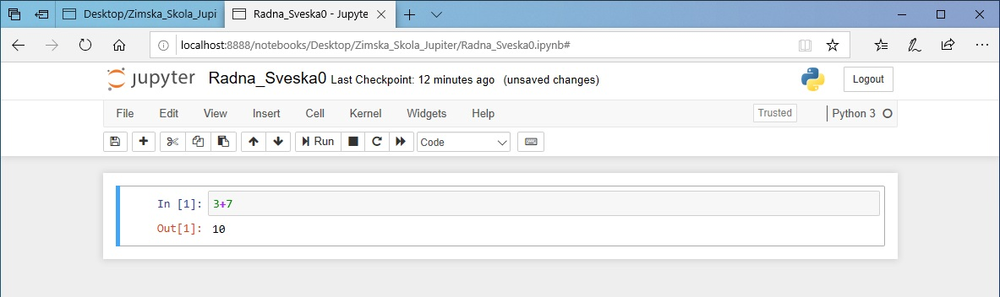
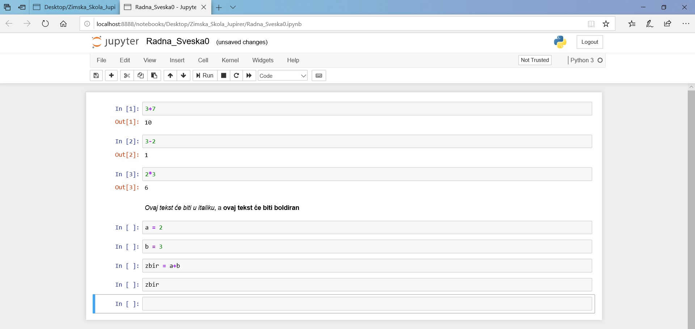
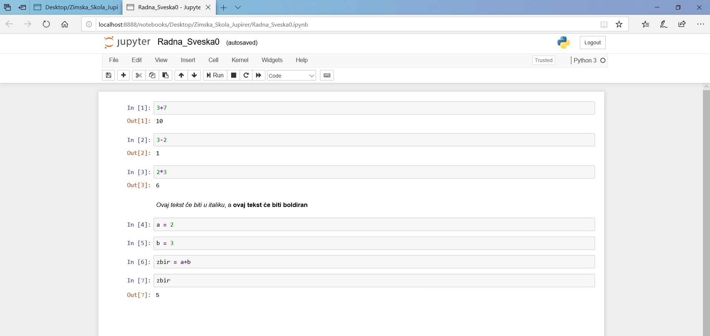
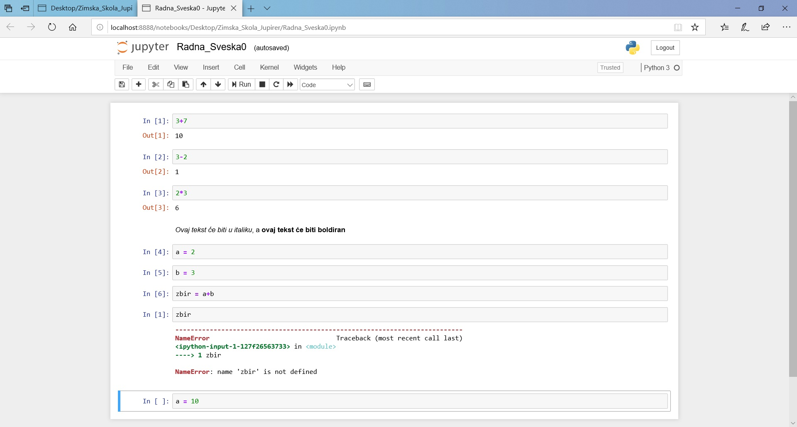

=====================
Pre nego što počnemo
=====================

Zdravo!

Ako čitaš ovo uputstvo znači da si nas kroz svoju prijavu ubedio/ubedila da baš tebe treba da izaberemo od svih prijavljenih kandidata. Čestitamo ti na tome. Sada između tebe i početka škole stoje još samo koraci koji se nalaze u ovom uputstvu. Pre nego što dođeš na prvo predavanje biće potrebno da pripremiš nekoliko stvari na svom računaru. Ako sve bude išlo kako treba, za ovo ti neće trebati više od 45 minuta.

Instalacija Anakonde
::::::::::::::::::::

Osim toga što je bioskopski hit devedesetih i nesrećni singl sredine prošle dekade, Anakonda je druga zmija koja će ti, pored Python-a, pomoći pri učenju programiranja. Šalu na stranu, Anakonda predstavlja distribuciju programskog jezika Pajton (i programskog jezika R) prilagođenu radu sa podacima. Iako sve potrebne programe, pakete i biblioteke za ovaj kurs možeš instalirati i pojedinačno, preporučujemo da koristiš Anakondu zato što ćeš tako, objedinjeno na jednom mestu, odjednom instalirati sve što je potrebno. Anakonda obuhvata i čini udobnijim rad sa nizom različitih okruženja, paketa i biblioteka, namenjenih analizi i obradi podataka, među kojima je i Jupyter. 

Ako već imaš iskustva sa instalacijom Python-a i upotrebom Jupyter-a sa Python-om (na svom računaru već imaš instaliran Python, Jupyter, ranije si instalirao/instalirala biblioteke pomoću pip-a i siguran/sigurna si da to sve radi), ne moraš da koristiš Anakondu. U tom slučaju pretpostavljamo da znaš šta radiš i da ti ne treba tehnička podrška. Postaraj se samo da instaliraš ove biblioteke pre nego što dođeš na prvo predavanje (numpy>=1.1, matplotlib>=3.0, pandas>=0.23, xlrd>=1.1, openpyxl>=2.5, lxml>=4.2, jupyter>=1.0)

Ako je prvi put da istaliraš Python i Jupyter kod sebe na računaru, na  pravom si mestu. Potrebno je da odeš na ovaj link https://www.anaconda.com/distribution/#download-section i da izabereš operativni sistem koji koristiš, izabereš verziju Python 3.7 i klikneš na Download. Ovo će pokrenuti skidanje instalacionog fajla. Kada se preuzimanje završi pokreni instalacioni fajl i isprati instalacioni proces kao što je dole opisano. Ovde ćemo ti pokazati kako to da uradiš na *Windows 10* operativnom sistemu, ali i na drugim sistemima proces izgleda slično pa ne očekujemo da ćeš imati problema prilikom instalacije. 

Korak 1. - započni instalaciju i na prvom prozoru klikni next

|
Korak 2. - Na sledećem prozoru odgovori da li se slažeš sa uslovima korišćenja. 

|
Korak 3. - Ovaj korak je jako važan! izaberi opciju **Just me** koja je preporučena. Instalirajući Anakondu samo za svoj nalog, izbeći ćeš neudobnosti u radu koje mogu da se jave ako izabereš opciju instalacije za sve korisnike, koja ti treba jedino u slučaju da više ljudi na istom računaru želi da koristi Anakondu sa različitih naloga. 

.. image:: ../_images/slika3.jpg
   :align: center

|
Korak 4. - Izaberi lokaciju na kojoj će biti instalirana Anakonda. Osim ako nema posebne potrebe da se Anakonda instalira na nekoj drugoj lokaciji, preporučujemo da koristiš lokaciju koju ti je instaler predložio. Predložen folder je obično u formi *C:\\Users\\korisničko_ime\\Anaconda3* kao što je kod nas na sledećoj slici. 

.. image:: ../_images/slika4.jpg
   :align: center

|
Korak 5. - I ovaj korak je važan. Preporučujemo opciju da Anakondu prijaviš kao osnovni Python na tvom sistemu. Ovo će pomoći da ostali programi lakše prepoznaju Anakondu. Kada to uradiš klikni na **install**. Ako znaš šta radiš, možeš staviti Anakondu u PATH varijablu što ti može olakšati korišćenje Anakonde iz komandne linije, ali ti može zadati i glavobolje ako se time poremeti rad drugih aplikacija koje koriste PATH varijablu.

|
Korak 6. - kada se završi instalacija, trebalo bi da dobiješ prozor koji izgleda kao na slici ispod i klikneš na *Next >*

.. image:: ../_images/slika7.jpg
   :align: center  

|
Korak 7. - Na sledećem prozoru klikni na *Next >*

.. image:: ../_images/slika8.jpg
   :align: center  

|
Korak 8. - Ako je sve proteklo kako treba, trebalo bi da stigneš do prozora koji se nalazi na slici ispod. Tu možeš da odabereš opciju da se upoznaš sa Anaconda Cloud-om (koji ti neće trebati za ovaj kurs), a možeš i da prođeš kroz uvod koji su oni napravili za početnike. Ovo drugo ti može biti korisno, ali bismo ti preporučili da nastaviš sa ovim našim uputstvom. Nije što je naše, ali omogući će ti da nastaviš sa elementima rada sa Anakondom koji će biti relevantni za ovaj kurs, a kada ga završiš, na ovom  `linku <https://docs.anaconda.com/anaconda/user-guide/getting-started/>`_ nalazi se dokumentacija koju možeš da pogledaš i koja će ti pokazati šta sa Anakondom još možeš da radiš

Prva radna sveska
:::::::::::::::::

Instalirao/instalirala si Anakondu? Sjajno, počni da čitaš ovaj deo uputstva. Ako si imao/imala problema prilikom instalacije Anakonde ili primetiš da imaš nekih tehničkih problema prilikom pokretanja i korišćenja radnih sveski na svom računaru (što će biti obrađeno u ovom delu uputstva), možeš koristiti Jupyther kroz uslugu u oblaku, a jedna takva mogućnost je opisana u celini.

U ovom delu uputstva upoznaćeš se sa Jupyter radnim sveskama. Ideja je da, pre nego što dođeš na prvo predavanje, stekneš utisak o tome šta su radne sveske i kako izgledaju, kao i da isprobaš korišćenje nekih jednostavnih mogućnosti koje Jupyter pruža. Ne brini, tokom celokupnog programa mnogo ćeš se detaljnije upoznati sa Jupyter-om i steći ćeš mnogo više prakse, ali za sada je dovoljno da isprobaš stvari koje se nalaze u ovom uputstvu kako bi stekao/stekla okvirni utisak o tome kako izgleda rad sa Jupyter radnim sveskama. Kada bismo te učili da igraš šah, ovo bi bio korak u kome treba da naučiš kako izgleda šahovska tabla na početku partije i kako se zove koja figura. Sama partija će krenuti tek kasnije. 

Prvo što treba da uradiš je da pokreneš Jupyter Notebook. Pronađi ga u startnom meniju i pokreni ga, kao na slici ispod

|
To će pokrenuti komandni prozor koji izgleda kao ovaj na slici ispod. Jako je važno da taj komandni prozor ne gasiš dokle god radiš u Jupyter-u. Dok je ovaj prozor otvoren, na lokalnom serveru (na tvom računaru) otvorene su Jupyter sveske. Kada zatvoriš prozor, izgubiće se i mogućnost da pristupiš sveskama.

|
Pored komandnog prozora otvoriće se i brauzer, onaj koji je obeležen kao glavni na tvom sistemu - u ovim primerima je to Microsoft Egde, ali kod tebe može biti Google Chrome, Mozila Firefox ili bilo koji drugi (prim. aut. relativno formalna priroda ovog teksta zahtevala bi da brauzer zovem pregledačem veba, ali, kako ga nikada ne zovem pregledačem, a prilično sam siguran da ni ti to ne radiš, koristiću termin brauzer pošto verujem da će tekst tako biti lakši za praćenje). Link koji će se automatski otvoriti u tom pregledaču (vidiš, `pregledač` zvuči neprirodno) biće link koji se nalazi u komandnom prozoru (obeležen crveno na slici iznad) i vodiće ka početnoj strani Jupyter Notebook-a u kojoj ćeš videti stablo sa folderima na svom računaru, kao na slici ispod. Ako koristiš Google Chrome, može da se desi da ne može automatski da ode na ovaj link i da će otvoriti stranu kojoj ne može da pristupi. U tom slučaju, potrebno je da otvoriš inkognito prozor (klikneš na otvoren prozor pretraživača i pritisneš Ctrl+shift+N) i tu iskopiraš link koji se nalazi u komandnom prozoru (na primeru slike iznad to bi bio link `http://localhost:8888/?token=c0a96f56c27449b3a5dda6129d189dd249bb4e194dc8b4c2`)

|
Dakle, pokretanjem Jupyter-a su se otvorila dva prozora: jedan crni komandni koji samo treba da ostavimo i ne diramo, a drugi je prozor brauzera u kome zapravo radimo. Tehnički se u komandnom prozoru u lokalu izvršava mali web server na kome radi Jupyter, a kome pristupamo kroz brauzer. To znači da bi gašenjem komandnog prozora prestao da radi Jupyter, a brauzer bi nam rekao da više ne može da uspostavi konekciju sa serverom. Na taj način bismo mogli da izgubimo i promene koje smo skoro unosili.  Ako na kraju rada u Jupyter-u uredno pokrenemo opciju „Quit“ (dugme u gornjem desnom uglu web strane), zatvoriće se i komandni prozor u kome radi web server.  Naravno, ukoliko više nemamo otvoren Jupyter u brauzeru, ali nam je sticajem okolnosti ostao otvore komandni prozor, tada taj komandni prozor možemo ugasiti.

Sav rad sa Jupyter sveskama odigraće se u brauzeru tako da ćemo se sada fokusirati upravo na otvoren tab. Prva korisna stvar koju možemo da uradimo je da napravimo novi folder u kome ćemo raditi sa sveskama. Pozicioniraj se tamo gde želiš da napraviš novi folder (prosto klikni na lokaciju gde želiš da napraviš taj folder). Ja ću to uraditi na desktopu tako da ću u ovoj listi izabrati desktop. Kada se nalaziš tamo gde želiš da napraviš folder, potrebno je da klikneš na dugme **New** u gornjem desnom uglu i iz menija koji izađe izabereš **folder**. 

|
Ovo će napraviti novi folder tamo gde si izabrao. Ako pogledaš sledeću sliku, videćeš da taj folder sada vidim i na desktopu i kroz Jupyter

|
Hajde da mu sada damo ime. To ćemo uraditi tako što ćemo kliknuti na kvadratić pored njega i u meniju koji se iznad pojavi kliknuti na **rename**, a zatim izabrati kako će da nam se zove folder. Ja sam svoj nazvao Zimska_Skola_Jupiter. Uđi sada u svoj folder (klikni na njega) i hajde da u okviru njega napravimo novu radnu svesku. To ćemo uraditi tako što ćemo ponovo ići na **New** i zatim izabrati **Python 3**. Ovo bi trebalo da u ovom folderu napravi novi Untitled.ipynb fajl (ekstenzija .ipynb se koristi za Pajton radne sveske) i da u novom tabu brauzera otvori radnu svesku koja će izgledati kao sveska na slici ispod.  

.. image:: ../_images/slika15.jpg
   :align: center 

|
Čestitam, upravo si napravio/napravila svoju prvu Jupyter svesku. Hajde i njoj da damo ime. To ćeš uraditi tako što ćeš kliknuti na **Untitled** naslov koji se nalazi skroz gore, pored logotipa Jupyter-a na slici iznad. To će ti omogućiti da uneseš ime koje želiš. Ja ću moju nazvati Radna_Sveska0. 

Svaka Jupyter sveska sastoji se od ćelija. Ovo što vidiš na slici iznad, beli pravougaonik u kome se nalazi manji pravougaonik u kome piše In [], predstavlja jednu ćeliju. U ćelijama se mogu nalaziti različite stvari - Python kod, tekst, matematički izraz, komande za komandnu liniju... Sve što želimo da smestimo u Jupyter svesku mora se nalaziti u nekoj od ćelija.

Jupyter sveske imaju dva različita moda - mod za editovanje i komandni mod. Mod za ediotvanje koristimo kada želimo da menjamo sadržaj ćelija. U taj mod možemo da uđemo tako što ćemo pritisnuti **Enter** ili tako što ćemo kliknuti na ćeliju. Kada to uradiš videćeš da je ćelija dobila zeleni okvir, a da se u gornjem desnom uglu pojavila olovčica koja označava da smo u modu za editovanje.   

.. image:: ../_images/slika16.jpg
   :align: center

|
Da bismo se vratili u komandni mod potrebno je da pritisnemo **Esc** dugme ili kliknemo negde van ćelije. Pravougaonik će da poplavi i olovičica će se izgubiti. Ne moraš se previše opterećivati time u kom si modu pošto je taj prelazak prilično intuitivan i jako brzo ćeš se uhodati kada koji mod koristiš. Imaj samo u vidu da će se, pored navedenih stvari, u ovim modovima razlikovati i prečice na tastaturi za različite komande. Njih možeš videti tako što ćeš kliknuti na **Help** i pogledati **Keyboard Shortcuts**. U ovom meniju postoji još nekoliko korisnih opcija. Ako u bilo kom trenutku zaboraviš stvari koje se nalaze u ovom uputstvu, klikni na **User Interface Tour** i on će ti ukratko objasniti šta je koji deo Jupyter interfejsa i čemu služi. Tu se nalaze i linkovi ka korisnim podsetnicima za određene biblioteke (ovo će ti biti korisnije kako tvoje učenje bude odmicalo). 

.. image:: ../_images/slika17.jpg
   :align: center

|

Hajde sada da vidimo kako izgleda rad sa ćelijama. U ćeliju koja je na ekranu ćemo uneti neki matematički izraz, na primer ``3+7`` i pritisnuti dugme **Run** (ili iskoristiti prečicu **Ctrl** + **Enter** ).

.. image:: ../_images/slika18.jpg
   :align: center

|
Trebalo bi da dobiješ rezultat kao na slici ispod. U prvom redu nalaze se ulazne vrednosti, a u drugom redu nalaze se vrednosti koje je tvoj program ispisao. 

|
Da bi dodao/dodala novu ćeliju, potrebno je da klikneš na dugme sa plusićem, što će dodati novu ćeliju ispod trenutno izabrane, ili da klikneš a dugme **Insert** gde ćeš moći da izabereš da li želiš da ćeliju dodaš ispod ili iznad one na kojoj se trenutno nalaziš. 

|
Probaj sada da sam/sama dodaš nove ćelije, u njih uneseš izraze ``3-2``, ``2*3``, ``9/3`` i zatim ih pokreneš. Trebalo bi da dobiješ rezultate kao na slici ispod. 

.. image:: ../_images/slika21.jpg
   :align: center

|
Možeš svaku ćeliju pokretati pojedinačno, ali možeš i da klikneš na dugme **Cell** koje će ti ponuditi meni sa različitim opcijama za pokretanje ćelija. Možeš ih pokrenuti sve odjednom, a možeš pokrenuti samo one koje se nalaze ispod ili iznad tvoje ćelije. Ćelije možeš da pomeraš gore-dole tako što ćeš kliknuti na strelice koje se nalaze pored dugmeta **Run**. 

U **Cell** meniju ćeš videti i opciju **Cell Type** pomoću koje biraš da li će tvoja ćelija da bude ćelija u kojoj se nalazi kod ili ćelija u kojoj se nalazi tekst (ova opcija postoji i u Notebook Toolbar-u kao padajući meni sa desne strane). Ćelije koje smo do sada koristili su sve bile ćelije u kojima se nalazio kod. 

|
Klikni na poslednju ćeliju, izaberi da njen tip bude Markdown i pokreni je. Videćeš da se neće ponašati kao do sada, to jest neće imati ulaznu vrednost (Python kod) i izlaznu vrednost (rezultat izvršavanja koda), već će izraz biti prikazana kao tekst, bez izračunavanja. To je zato što je Markdown format koji koristimo da bismo u Jupyter ćelijama pisali tekst. Ovo je sada postala tekstualna ćelija. Markdown možeš posmatrati kao poseban način zapisivanja teksta tako da sam tekst sadrži informacije o tome kako treba da bude formatiran. Određeni programi, kao što su brauzeri, tumače te dodatne informacije o formatiranju i tekst na kraju prikazuju kako je željeno. Iskopiraj ovaj tekst ``*Ovaj tekst će biti u italiku\*, a \__ovaj tekst će biti boldiran__`` u ćeliju čiji je tip Markdown i zatim je pokreni pokreni. Obrati pažnju šta se desilo sa zvezdicama i donjim crtama kada si pokrenuo/pokrenula ćeliju (trebalo bi da izgleda kao na slici ispod). Kao što si mogao/mogla da vidiš, tekst se u Markdown-u zapisuje na jedan način, ali se nakon pokretanja prikazuje na drugi. Ako želiš da se bolje upoznaš sa sintaksom (pravilima zapisivanja i formatiranja) Markdown-a, možeš da odeš na ovaj `link <https://help.github.com/en/github/writing-on-github/basic-writing-and-formatting-syntax>`_

Tekstualna polja su važna pre svega zato što nam dozvoljavaju da dokumentujemo ono što smo radili i da ga struktuiramo tako da, onome ko čita, iz naših komentara bude jasno šta smo hteli da izračunamo. Kod koji pišemo zato mora biti dobro dokumentovan u kom god programskom jeziku da radimo. Nama samima je, u trenutku pisanja, (uglavnom) jasno šta pokušavamo da uradimo, ali kada čitamo kod koji je neko drugi pisao, često ume da bude vrlo problematično rastumačiti čemu koji element služi, pogotovo ako kod nije bio dobro dokumentovan. Štaviše, neretko je i sopstveni kod nečitljiv kada mu se vratimo posle nekog vremena, a nismo dokumentovali ono što radimo. Jupyter, tako, ne samo da nam pruža mogućnost da izvršimo različita izračunavanja već da, koristeći kombinaciju tekstualnih polja i polja u kojima računamo, ispričamo priču o tome šta smo radili, priču koja će drugima biti jasna, korisna i koja će im omogućiti da i oni ponove naša izračunavanja. 

.. image:: ../_images/slika23.jpg
   :align: center

|
Verovatno si do sada primetio/primetila da u uglastim zagradama u ćelijama stoji neki broj. Taj broj predstavlja redosled izvršavanja ćelija. Za našu trenutnu svesku redosled izvršavanja je nebitan. Ćelije su nezavisne jedna od druge i možemo iz izvršavati pojedinačno, kojim god redosledom želimo, ali možemo zadata i komandu **Run all** u meniju *Cell* i sve ćelije će biti izvršene, odozgo nadole (to je uobičajeni redosled izvršavanja, osim ako se izričito ne zada drugačiji redosled). Međutim, često ćeš se susretati sa primerima gde je redosled izvršavanja važan.

Hajde da dodamo još nekoliko ćelija u kojima ćemo ovog puta iskoristiti nešto što se zovu varijable. U ovom trenutku nema potrebe da se baviš time šta su tačno varijable, ali možeš da ih posmatraš kao kutije u kojima se čuvaju vrednosti i koje pomažu uopštavanju tog koda. Da bismo izračunali zbir brojeva 2 i 3, uvek možemo da napišemo kod ``2+3`` koji će nam uvek davati tačan rezultat pošto Python i Jupyter, kao što si do sada video, možemo koristiti kao najobičniji kalkulator, ali, kada bismo želeli da naš kod ne izračunava samo zbir brojeva 2 i 3 već da može da izračuna zbir bilo koja 2 broja, pisali bismo ga u opštijoj formi, koristeći varijable 
::
    a=2
    b=3
    zbir=a+b
    zbir

U kodu koji se nalazi iznad, možemo uvek promeniti vrednosti varijablama ``a`` i ``b``, ali naš program će i dalje ispisivati njihov zbir. Kada bismo umesto 2 broja imali 50 brojeva i hteli da promenimo jedan od njih, ne bismo morali da ponovo ispisujemo ceo izraz u kome sabiramo pedeset brojeva, već bismo promenili samo onaj koji želimo i ponovo pokrenuli program. Hajde da probamo da ovo primenimo na Jupyter radnu svesku. U četiri nove ćelije napisaću po jednu liniju gornjeg programa. Naša sveska će sada izgledati ovako (još uvek nisam pokrenuo ni jednu od novih ćelija)

|
Hajde sada da pokrenemo ove ćelije odozgo na dole, jednu po jednu i vidimo šta će da se desi. Prvo je varijabli ``a`` dodeljena vrednost 2 (operacija 4), zatim je varijabli ``b`` dodeljena vrednost 3 (operacija 5). Zatim je u operaciji šest varijabli ``zbir`` dodeljena vrednost ``a+b`` i na kraju, u operaciji 7, vraćena je vrednost varijable ``zbir``. 

|
Hajde sada da ispod varijable ``zbir`` dodamo još jednu ćeliju u kojoj ćemo vrednost ``a`` promeniti u 10, pokrenemo je i da nakon toga ponovo pokrenemo ćeliju koja vraća vrednost varijable ``zbir``. Videćeš da se zbir i dalje nije promenio iako smo promenili vrednost varijable ``a``. Razlog tome je što je redosled izvršavanja takav da smo prvo dobili vrednost varijable ``zbir`` (operacija 6), a tek onda promenili vrednost varijable ``a`` (operacija 8). Nakon toga smo ponovo pokrenuli ćeliju koja nam je vratila nepromenjenu vrednost varijable ``zbir`` (operacija 9). Da bismo dobili novu vrednost varijable ``zbir``, potrebno je da ponovo izvršimo ćeliju u kojoj se ova varijabla izračunava i da zatim ponovo pokrenemo ćeliju koja vraća njenu vrednost.  

Kao što smo videli na ovom primeru, redosled izvršavanja ćelija je važan. Iako se neka ćelija fizički nalazi ispod neke druge ćelije, to ne znači da će rezultat njenog izvršavanja doći nakon ćelije koja je iznad nje. Ćelije se mogu izvršavati više puta i važno je da stalno imamo u vidu koje će biti vrednosti i redosled izvršavanja koda u našim ćelijama. 

Ovo nas dovodi i do korišćenja Kernela. Kernel u računarstvu ima više značenja, ali u ovom kontekstu ga treba posmatrati kao deo Jupyter-a u kome se izvršava Python kod. Kernel pamti koje su vrednosti varijabli, izračunava izraze i slično...  Kada klikneš na dugme Kernel koje se nalazi u gornjem meniju, ponudi ti se niz korisnih naredbi za Kernel. Hajde sada da probamo da restartujemo Kernel tako što ćemo kliknuti na dugme **Restart**. Izaći će ti poruka koja će te pitati da li sigurno želiš da restartuješ Kernel. Klikni na **Restart** i probaj ponovo da pokreneš ćeliju koja vraća vrednost varijable ``zbir``.

|
Desiće se dve stvari. Prvo, ova ćelija će biti obeležana sa 1 zato što je redosled izvršavanja krenuo od početka i drugo, sistem će prijaviti grešku. Kako smo restartovali Kernel, on sada ne zna šta se nalazi u kojoj ćeliji dok ih ne izvršimo i, zbog toga, ne može da zna ni šta treba da odštampa. Ako pokušamo da pokrenemo ćeliju u kojoj definišemo varijablu ``zbir``, dobićemo istu grešku, pošto sistem ne zna šta su ``a`` i ``b``. Da bismo otklonili ove greške, potrebno je da prvo pokrenemo ćelije u kojima definišemo ``a`` i ``b``, a zatim ponovo pokrenemo ćelije u kojima je definisana varijabla ``zbir`` i ćeliju koja vraća njenu vrednost.

Jupyter nam nudi nekoliko opcija za rad sa Kernelom. Možemo ga restartovati, što smo sada uradili, ali možemo ga restartovati i obrisati sve izlazne vrednosti koje smo imali u prethodnom stanju. Ovo može biti korisno kada ne želimo da nas nakon restartovanja zbunjuju izlazne vrednosti koje su tu ostale pre restarta. Takođe, možemo restartovati Kernel i izvršiti sve ćelije ponovo, što praktično ponavlja celo izračunavanje od početka redom. Ako nekom treba da pošaljemo svesku, pre slana obično izvršimo ovu opciju. Na kraju, videćeš i opciju **Interrupt** koja se nalazi na vrhu. Često će se dešavati da se tvoj kod ne izvrši odmah, već da izvršavanje traje neko vreme, pogotovo kada radiš sa jako velikim brojem podataka. Ova opcija ti nudi mogućnost da prekineš izvršavanje koda u svakom trenutku. Da bi video koji Kernel koristiš (pored Python kernela koji mi koristimo, možeš koristiti i kernele za različite programske jezike, na primer R ili Ruby) dovoljno je da pogledaš u gornji desni ugao i tu ćeš videti o kom se kernelu radi i da li on trenutno izvršava neke naredbe (kružić će biti popunjen) ili ne (kružić će biti prazan)

Na kraju rada, ne zaboravi da klikneš na **Save** dugme (disketica u gornjem levom uglu) kako bi promene koje si uneo bile zapamćene. Naravno, možeš pritisnuti i **Ctrl** + **S** što će takođe zapamtiti file. 

Ako te ovo što smo sada uradili nije impresioniralo, ne brini, ta reakcija je sasvim u redu. Seti se, zadatak nam nije bio da naučimo kako da igramo šah nego da postavimo figure na tablu. Zanimljivije, komplikovanije i korisnije stvari tek slede. 

Distribucija materijala na kursu
--------------------------------

Sada smo završili rad u ovoj radnoj svesci i uradićemo još jednu stvar pre nego što završimo ovo uputstvo. U tvoj folder ubacićemo još jednu radnu svesku koju ćemo preuzeti sa našeg sa našeg Github repozitorijuma. U ovom trenutku ne moraš se baviti time šta je Github i kako se koristi, dovoljno je da isprobaš da u svoj folder ubaciš i radnu svesku koju si ovako preuzeo/preuzela, pošto ćemo ti tokom Škole tako distribuirati materijale. Klikni na ovaj link https://github.com/Petlja/ZSkola2020Modul0/archive/master.zip i to bi trebalo da pokrene preuzimanje .zip fajla. Taj fajl otvori i njegov sadržaj (folder koji se zove ZSkola2020Modul0-master) iskopiraj u folder koji smo napravili na početku ove sekcije uputstva (kod mene je to folder Zimska_Skola_Jupiter na Desktopu). Kada si to uradio/uradila, trebalo bi da u folderu koji je otvoren u jednom od tabova brauzera (ako nisi isključio/isključila ni jedan tab i dalje će biti tu, ako jesi ponovo možeš da odeš u onaj crni prozor i iskopiraš link) vidiš ovaj folder. Uđi u njega i otvori radnu svesku koja se u njemu nalazi.

Ako si koristio/koristila Azuer Notebooks servis, pogledaj u trećem delu uputstva kako da uvezeš Github repozitorijum. 

Kada to završiš, gotovo je sa tvojom pripremom za Školu. Ako je ostalo nešto nerešeno i/ili imaš pitanja koja nisu pokrivena ovim uputstvom, piši na lazar.bojicic@petlja.org 

Korišćenje radnih sveski pomoću servisa Azure Notebooks
:::::::::::::::::::::::::::::::::::::::::::::::::::::::

Ovaj deo uputstva preporučujemo da ispratiš samo ako nisi uspeo/uspela da instaliraš Anakondu i koristiš sveske na način na koji je opisano u prethodnoj sekciji uputstva. Pokušao/pokušala si da insaliraš i nije radilo, probao/probala si nekoliko puta ponoo i nije radilo, pretražio/pretražila si Google sa pitanjima zašto ti nešto ne možeš da instaliraš Anakondu ili pokreneš radne sveske na svom računaru? Ne brini, sveske ćeš moći da pokreneš u brauzeru i putem interneta i servisa Azure Notebooks. Gotovo da neće biti razlike pri korišćenju sveski.

Idi na ovaj `link <https://notebooks.azure.com/>`_ i klikni **Sing in** u gornjem desnom uglu. Ovo će te odvesti na stranu gde ćeš morati da napraviš svoj Microsoft nalog. Napravi nalog i uloguj se. Otvoriće ti se prozor kao ovaj na slici ispod. Klikni na **New Project** i to će započeti novi projekat na tvom nalogu. 

.. image:: ../_images/slika27.jpg
   :align: center
|
Nakon toga, otvoriće ti se prozor na kome je potrebno da daš ime svom projektu i podesiš neke parametre. Ja sam ih popunio ovako. Kada završiš imenovanje klikni na **Create**

|
Kada to uradiš, otvoriće ti se prozor tvog novog projekta. U gornjem desnom uglu klikni na **New** i izaberi Notebook, a zatim svesci daj ime i izaberi Python 3.6. Klikni na novu radnu svesku koju si napravio/napravila i to će otvoriti novi tab u kome će se otvoriti radna sveska. Dalje možeš sve da radiš kao što je opisano u prethodnoj sekciji ovog uputstva. 

|
Kada završiš sa radom i zapamtiš svoju radnu svesku, svaki put ćeš moći da je nađeš i otvoriš u okviru svog profila.

Važno je i da naučiš kako da uvezeš radne sveske sa Github-a, pošto ćemo ti tako dostavljati materijal sa kursa. Na strani My projects, u okviru Azure Notebooks (link ka toj strani biće notebooks.azure.com/tvoje_korisničko_ime/projects) moći ćeš da gore desno klikneš na Upload Github Repo. Otvoriće ti se prozor u kome će biti važno da u gornje polje uneseš link ka našem repozitorijumu. Link ćeš dobiti od nas i uvek će biti u ovom formatu github.com/Petlja/Imerepozitorijuma. repo koji sada treba da uvezeš nalazi se na ovom linku https://github.com/Petlja/ZSkola2020Modul0 a od tebe se očekuje da iskoristiš deo Petlja/ZSkola2020Modul0 kao što je prikazano na slici ispod. Klikni na *Import* i to će u okviru tvojih projekata otvoriti naš repozitorijum u kome se nalaze potrebne radne sveske. 

|
Zatim klikni na fajl Test Sveska i to bi trebalo da otvori nov tab sa ovom sveskom. Tokom škole ćeš od nas dobijati materijale u ovom obliku i biće potrebno da na ovaj način uvoziš Github repozitorijume na svoj nalog. 
